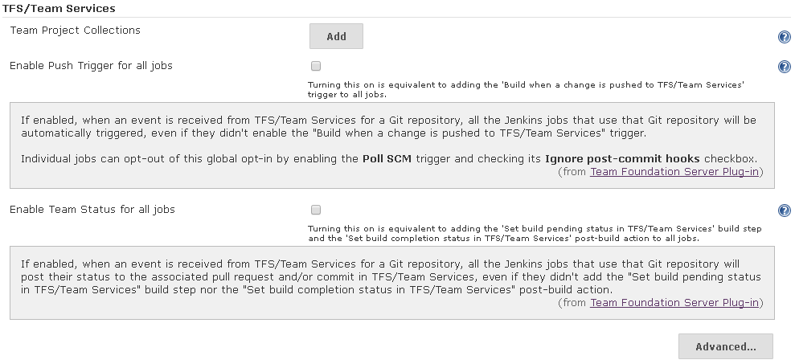
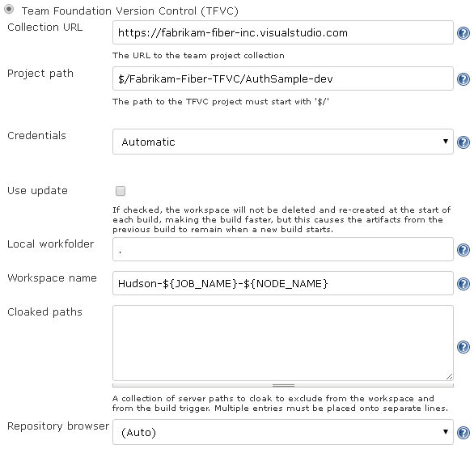
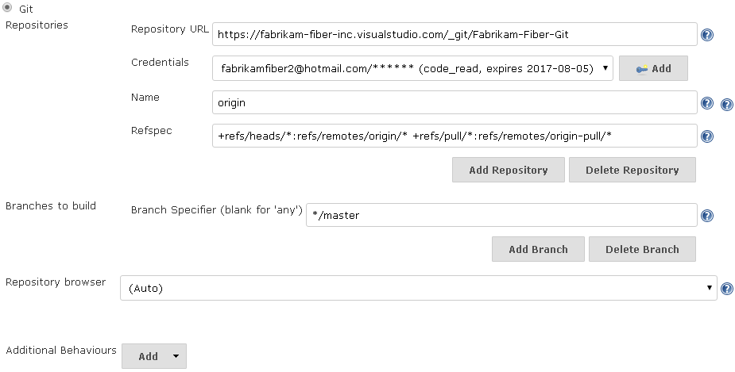
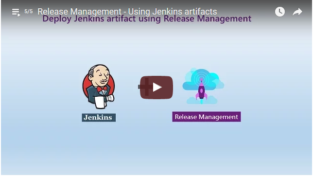
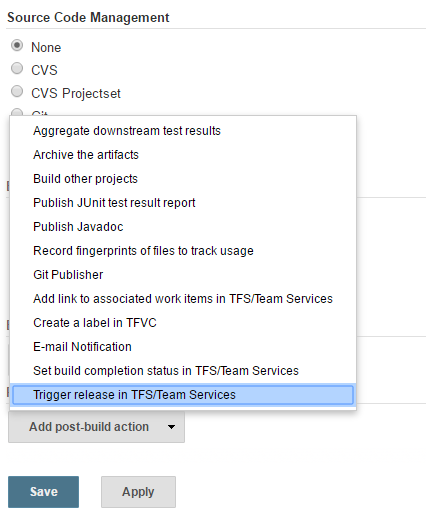
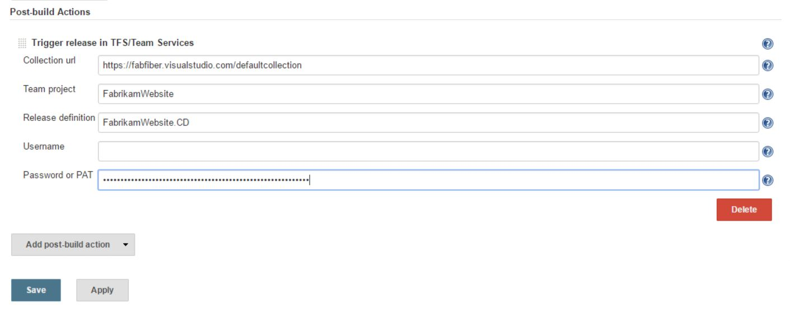

Team Foundation Server plugin for Jenkins
============================
Copyright &copy; Erik Ramfelt, Olivier Dagenais, CloudBees, Inc. and others.
Licensed under [MIT Licence].
 
## Summary
This plugin integrates [Team Foundation Version Control] (also known as TFVC) and Git to Jenkins by connecting to Team Foundation Server (TFS) and Visual Studio Team Services (Team Services). It also lets you trigger a release in Visual Studio Team Services, through a post-build step in Jenkins.

## Quick links
* The legacy [wiki] page on the Jenkins Confluence instance
* CI build status - [](https://ci.jenkins.io/job/Plugins/job/tfs-plugin/job/master/)
* Issues are tracked by the [Jenkins JIRA]
* Download the latest release [from the Jenkins CDN](http://updates.jenkins-ci.org/latest/tfs.hpi) or [from the GitHub Releases page](https://github.com/jenkinsci/tfs-plugin/releases)

## What can you do with it?

That depends on which version control system you use in TFS/Team Services:

### Team Foundation Version Control

Allows you to use a TFVC repository as an SCM in Jenkins jobs. At the moment, this plugin supports:
* Retrieving read-only copies of files and folders from a TFVC repository.
* Polling a TFVC repository to automatically start builds when there are changes.
* Links from the Jenkins change sets to the TFVC repository web interface. _(Also known as a repository browser)_
* Creating a label in the TFVC repository 

The plugin will automatically create a workspace in TFS/Team Services and map a work folder (in the Jenkins workspace) to it.


### Git

The TFS plug-in for Jenkins adds some features to better integrate with Git repositories hosted in TFS/Team Services:
* A push trigger, to request builds of specific commits in Git repositories without needing to schedule SCM polling
    * Instead of adding the **Build when a change is pushed to TFS/Team Services** trigger to every job, you can also check the checkbox next to **Enable Push Trigger for all jobs** in the Jenkins global configuration.  Individual jobs can still opt-out of this global opt-in by enabling the **Poll SCM** trigger and checking its **Ignore post-commit hooks** checkbox.
* A build step that adds a "build pending" status to the associated pull request and/or commit in TFS/Team Services
    * Instead of adding the **Set build pending status in TFS/Team Services** build step to every job, you can also check the checkbox next to **Enable Team Status for all jobs** in the Jenkins global configuration.
* A post-build action that add a "build completed" status to the associated pull request and/or commit in TFS/Team Services
    * Instead of adding the **Set build completion status in TFS/Team Services** post-build action to every job, you can also check the checkboxbox next to **Enable Team Status for all jobs** in the Jenkins global configuration.
* A link to (and summary information about) the associated TFS/Team Services build that triggered the Jenkins build.
* A link to (and summary information about) the associated TFS/Team Services pull request that triggered the Jenkins build.
    * Links to associated TFS/Team Services work items.
    * Associated TFS/Team Services work items link back to the Jenkins build.

There are two possibilities to trigger a build with SCM Changeset:
* TFS plugin  
  Please refer to the [Webhooks with Visual Studio Team Services](https://www.visualstudio.com/en-us/docs/service-hooks/services/webhooks) page for instructions on configuring the integration in TFS. Available endpoints can be found under [http://yourJenkins/team-events](http://yourJenkins/team-events)
* Git plugin  
  You have to enable Git SCM polling to receive commit notifications  
  Please refer to the [Jenkins with Visual Studio Team Services](https://www.visualstudio.com/en-us/docs/service-hooks/services/jenkins) page for instructions on configuring the integration in TFS.


# Supported versions

The following sub-sections list the various versions of software that were tested and are thus supported.  The plugin might work with other versions, they just haven't been tested.

## Team Foundation Server (TFS) / Visual Studio Team Services (Team Services)

The following table indicates compatibility and support for versions of TFS and Team Services.

> Version | Supported by the TFS plugin? | Mainstream Support End Date
> ------- | ------ | ---------------------------
> [Visual Studio Team Services] | :white_check_mark: | n/a
> Visual Studio Team Foundation Server 2017 | :white_check_mark: | [2022/01/11](https://support.microsoft.com/en-us/lifecycle/search?alpha=Visual%20Studio%20Team%20Foundation%20Server%202017)
> Visual Studio Team Foundation Server 2015 | :white_check_mark: | [2020/10/13](https://support.microsoft.com/en-us/lifecycle?p1=18576)
> Microsoft Visual Studio Team Foundation Server 2013 | :white_check_mark: | [2019/04/09](https://support.microsoft.com/en-us/lifecycle?p1=17358)
> Microsoft Visual Studio Team Foundation Server 2012 | :white_check_mark: | [2018/01/09](https://support.microsoft.com/en-us/lifecycle?p1=16804)
> Microsoft Visual Studio Team Foundation Server 2010 | :x: | :warning: [2015/07/14](https://support.microsoft.com/en-us/lifecycle?p1=15011)
> Microsoft Visual Studio Team System 2008 Team Foundation Server | :x: | :warning: [2013/04/09](https://support.microsoft.com/en-us/lifecycle?p1=13083)
> Microsoft Visual Studio 2005 Team Foundation Server | :x: | :warning: [2011/07/12](https://support.microsoft.com/en-us/lifecycle?p1=10449)

Whereas for **Trigger release in TFS/Team Services** post build action, only following table is supported:

> Version | Supported by the TFS plugin? | Mainstream Support End Date
> ------- | ------ | ---------------------------
> [Visual Studio Team Services] | :white_check_mark: | n/a
> [Team Foundation Server "15" RC1] | :white_check_mark: | n/a

## Operating Systems

The plugin has been tested against the following operating systems and versions, with the latest updates as of 2015/08/27.

Name | Version
---- | -------
Windows Server | 2012 R2
Mac OS X | Yosemite 10.10.5
Ubuntu Linux | Server 14.04 LTS

## Jenkins

The plugin is built against Jenkins version **1.580** and that's the version integration tests are run against.

# Configuration

## Requirements

### 4.0.0 and later (New!)

Ever since release 4.0.0, a command-line client or tool is no longer necessary as all the interaction with TFS or Team Services is done using the [TFS SDK for Java].  The native libraries needed by the SDK are automatically copied to a sub-directory under the agent user's home folder.

### 3.2.0 and earlier

Versions 3.2.0 and earlier of the plugin required a command line tool to be installed on the build agents to retrieve source code from the TFVC repository.

1. Install either Microsoft Visual Studio or [Microsoft Team Explorer Everywhere] Command-Line Client (CLC) on the build agents
2. Add `tf.exe` (Visual Studio) OR one of `tf.cmd` or `tf` (TEE CLC) to the `PATH` of the build agents' user(s).

## Global configuration

To make use of the Git integration with TFS/Team Services and/or to use automatic credentials configuration with the TFVC SCM, it is necessary to first configure your team project collection(s).  Follow these instructions for each team project collection (most organizations will only have one).

1. Add credentials:
    1. Select **Jenkins** > **Credentials**
    2. Select **Add domain**
        1. In the _Domain Name_ field, enter the host's friendly name, such as `fabrikam-fiber-inc`
        2. In the _Description_ field, you can enter some notes, such as who maintains the server, etc.
        3. Next to _Specification_, select **Add** > **Hostname**
            1. In the _Include_ field, enter the Fully-Qualified Domain Name (FQDN), such as `fabrikam-fiber-inc.visualstudio.com`
        4. Click **OK**
    3. Select **Add Credentials**
        1. For the _Kind_ field, select **Username with password**
        2. For the _Scope_ field, select **Global (Jenkins, nodes, items, all child items, etc)**
        3. See the _User name and password_ section below for the values of the _Username_ and _Password_; a Personal Access Token (PAT) is strongly recommended.  If the credentials will be used for TFVC, select **All scopes**, otherwise select the following _Authorized Scopes_:
            1. `Code (read)`
            2. `Code (status)`
            3. `Work items (read and write)`
        4. You can use the _Description_ field to record details about the PAT, such as its intended collection, the selected authorization scopes and expiration date.  For example: `fabrikam-fiber-inc, code read+status, wit read+write, expires 2017-08-05`
        5. Click **OK**   
2. Add the collection URL and associate it with the right credentials:
    1. Select **Jenkins** > **Manage Jenkins** > **Configure System**
    2. Scroll to **TFS/Team Services** and click **Add**
        1. If using Team Services, the value of the _Collection URL_ field should omit `/DefaultCollection`.
        2. Select the associated `Credentials` value created earlier.
        3. Click **Test Connection**.
    3. Click **Save**

### Automatic integration

To avoid having to configure every job to enable integration features, you can check the checkbox next to either or both of:

* Enable Push Trigger for all jobs
* Enable Team Status for all jobs



### Advanced

In some environments, the "home" directory is mounted over a network and shared between many computers, including Jenkins servers and their associated build nodes, which eventually leads to corruption of the configuration directory used for TFVC workspaces.  If you have such an environment, check the box next to **Store TFVC configuration in computer-specific folders** to use a sub-directory for each computer. :warning: WARNING :warning: Turning this on is equivalent to setting the `TEE_PROFILE_DIRECTORY` environment variable and thus any manual operations performed using the Command-Line Client (CLC) will need to be performed with the `TEE_PROFILE_DIRECTORY` environment variable set accordingly.

## Job configuration

### Team Foundation Version Control

If your source code is in a TFVC repository, this section is for you.



Field | Description
----- | -----------
`Collection URL` | The URL to the [Team Project Collection](https://msdn.microsoft.com/en-us/library/dd236915(v=vs.120).aspx). If you added your team project collection(s) in the global configuration, the field will show you a list to pick from. Examples: `https://tfs02.codeplex.com`, `https://fabrikam-fiber-inc.visualstudio.com`, `http://tfs:8080/tfs/DefaultCollection`
`Project path` | The Team Project and path to retrieve from the server. The project path must start with `$/`, and contain any sub path that exists in the project repository. Example: `$/Fabrikam-Fiber-TFVC/AuthSample-dev`
`Credentials` | If you added your team project collection(s) in the global configuration, select **Automatic** and the credentials will be looked up automatically, otherwise you can select **Manual** and configure the `User name` and `User password` fields.
`Manual` > `User name` | The name of the user that will be connecting to TFS/Team Services to query history, checkout files, etc. See _User name and password_ below for a full description.
`Manual` > `User password` | The password, alternate password or personal access token associated with the user. See _User name and password_ below for more details.
`Use update` | If this option is checked, then the workspace will not be deleted and re-created at the start of each build, making the build faster, but this causes the artifacts from the previous build to remain when a new build starts.
`Local workfolder` | The name of the local work folder. The specified folder will contain the files retrieved from the repository. Default is `.`, ie the files will be downloaded into the Hudson workspace folder.
`Workspace name` | The name of the workspace that Jenkins should use when creating and deleting workspaces on the server. The workspace name supports three macros; `${JOB_NAME}` is replaced by the job name, `${USER_NAME}` is replaced by the user name Jenkins is running as and `${NODE_NAME}` is replaced by the name of the node. Default workspace name is `Hudson-${JOB_NAME}-${NODE_NAME}`.
`Cloaked paths` | A collection of server paths to cloak to exclude from the workspace and from the build trigger. Multiple entries must be placed onto separate lines.
`Repository browser` | Select `Microsoft Team Foundation Server/Visual Studio Team Services` to turn on links inside Jenkins jobs (in the **Changes** page) back to TFS/Team Services, for easier traceability.  If the TFS server is reached by users through a different URL than that provided in `Collection URL`, such as the Fully-Qualified Domain Name (FQDN), provide a value for the `URL` sub-field.

### Git

If your source code is in a Git repository located on a TFS/Team Services server, this section is for you.

> :warning: Make sure you first followed the instructions in the **Global configuration** section and added your team project collection(s), associated with credentials. :warning:



If you didn't have the Git plug-in for Jenkins already, installing the TFS plug-in for Jenkins should have brought it on as a dependency.

1. Use the **Git** _Source Code Management_ and add the URL to your Git repository in TFS/Team Services, omitting the `/DefaultCollection` if you are using Team Services.
2. If you haven't done so already, follow the instructions in the "User name and password" section to generate a Personal Access Token, and then add a "Credentials" entry as specified in the "Global configuration" section.  You should then be able to select it in the _Credentials_ field.
3. To be able to build the merge commits created for pull requests in TFS/Team Services, click the **Advanced...** button
    1. In the _Name_ field, enter **origin** (or some unique name if you already have other repositories)
    2. In the _Refspec_ field, enter `+refs/heads/*:refs/remotes/origin/* +refs/pull/*:refs/remotes/origin-pull/*` (replacing "origin" as necessary)
4. If you haven't already enabled the Push Trigger for all jobs, scroll down to _Build Triggers_ and you can check the **Build when a change is pushed to TFS/Team Services** checkbox.
5. If you haven't already enabled Team Status for all jobs, scroll down to _Build_, select **Add build step** > **Set build pending status in TFS/Team Services**, moving it _first_ in the list of steps, to notify TFS/Team Services as early as possible that a Jenkins build has been started.
6. Add other build steps, as necessary. 
7. If you haven't already enabled Team Status for all jobs, scroll down to _Post-build Actions_, select **Add post-build action** > **Set build completion status in TFS/Team Services**.
8. If you would like to collect results for publication in TFS/Team Services, scroll down to _Post-build Actions_, select **Add post-build action** > **Collect results for TFS/Team Services** and then add one or more results to collect.
9. If the Jenkins job will be used to validate pull requests in TFS/Team Services and you would like to add links from the associated work items back to the Jenkins build, select **Add post-build action** > **Add link to associated work items in TFS/Team Services**.

### User name and password

#### Team Foundation Server (on-premises)

For \[on-premises\] Team Foundation Server, the _User name_ can be specified in two ways:

1. `EXAMPLE-DOMAIN\user`
2. `user@domain.example.com`

#### Visual Studio Team Services (Team Services, previously known as Visual Studio Online)

For Team Services, there are also two options:

1. Personal access tokens (recommended)
    1. In Team Services, click your name in the top right corner and select **Security**.
    2. In the _Personal access tokens_ area, select **Add**.
    3. Describe the token (use something like "Jenkins server at jenkins.example.com"), select an expiry timeframe, double-check the Team Services account the token will be valid for and, if the user account will be used for TFVC, select **All scopes** otherwise you can select smaller scopes based on what features you will need.
    4. Click **\[Create Token\]** and copy the generated personal access token to the clipboard.
    5. Back to Jenkins, enter the e-mail address associated with your Team Services account as the _User name_ and the generated personal access token as the _User password_.
2.  Alternate credentials
    1. In Team Services, click your name in the top right corner and select **Security**.
    2. In the _Alternate credentials_ area, select **Enable alternate authentication credentials**.
    3. Enter a secondary user name and password, then click **\[Save\]**.
    4. Back to Jenkins, re-enter those credentials in the _User name_ and _User password_ fields.


## Checkout by label (New since version 3.2.0)

The plugin now supports checking out from a specific label or any valid [versionspec](https://www.visualstudio.com/docs/tfvc/use-team-foundation-version-control-commands#use-a-versionspec-argument-to-specify-affected-versions-of-items).  Here's how to configure a job to do that:

> :information_source: Polling the server doesn't make sense when you want to build for a specific label because polling is not \[currently\] label-aware and could queue a build **every polling interval**. :information_source:

1. Turn **off** SCM polling by making sure the **Poll SCM** checkbox is _cleared_ (unchecked).
2. Tick the **This build is parameterised** checkbox
    1. Add a **String Parameter**
    2. Set its _Name_ to **VERSION_SPEC**
    3. Set its _Description_ to the following:
    ```
    Enter a valid version spec to use when checking out.
    Labels are prefixed with "L" and changesets are prefixed with "C".
    See the following for a versionspec reference: https://www.visualstudio.com/docs/tfvc/use-team-foundation-version-control-commands#use-a-versionspec-argument-to-specify-affected-versions-of-items
    Examples: "LFoo", "C42"
    ```
3. **Save** the job.

Now, the next time you want to queue a build, you will need to provide a value for the **VERSION_SPEC** parameter.  The build will then perform a checkout of the source as of the specified **VERSION_SPEC**.

## Proxy server support (New since version 4.1.0)

In the event Jenkins is deployed on a network with no direct access to other networks (such as the internet), the TFS plugin now supports connecting through proxy servers.

> :information_source: Support for proxy servers requiring authentication was added in version 5.1.0. :information_source:

Follow the instructions at [JenkinsBehindProxy](https://wiki.jenkins-ci.org/display/JENKINS/JenkinsBehindProxy) to configure Jenkins' use of a proxy server, which the TFS plugin also uses.

## Integration with TFS/Team Services (New since version 5.0.0)

There are some steps to perform in both Jenkins and in TFS/Team Services to activate the integration.  This section assumes you have already configured one or more team project collections, as described in the **Global configuration** section above and then configured the Jenkins jobs as described in the **Git** section above.

### Trigger builds when code is pushed to a Git repository in TFS/Team Services

1. Go to the team project's _Administration_ and then select **Service Hooks**
2. Select the `+` button
3. Select **Jenkins** and click **Next**
4. Select **Code pushed**, configure the **Filters** and click **Next**
5. You can now configure which action will be performed.  The choices are **Trigger generic build** and **Trigger Git build**.  Once you select the action, its _Settings_ must be configured
    1. Enter the URL to your Jenkins server. (hint: it's the destination when you click the Jenkins logo in the top left)
    2. Enter your _User name_
    3. For the _User API token_, click on your user name in Jenkins (in the top-right corner), then **Configure** and finally click the **Show API Token...*** button.  Copy & paste the token back in TFS/Team Services
    4. Once valid credentials have been provided, more fields will become available.  If you selected **Trigger generic build**, keep going with these fields
        1. The _Build_ field should now be configurable as a drop-down list
        2. Add any additional parameters, if any
    5. Click **Test**, inspect the results of the test and click **Close**
    6. If the test was successful, click **Finish**

### Trigger builds when a pull request is created or updated in TFS/Team Services

1. Go to the team project's _Administration_ and then select **Service Hooks**
2. Select the `+` button
3. Select **Jenkins** and click **Next**
4. Select one of **Code pushed** or **Pull request merge commit created**, configure the **Filters** and click **Next**
5. The only action available is **Trigger generic build**, its _Settings_ must be configured
    1. Enter the URL to your Jenkins server. (hint: it's the destination when you click the Jenkins logo in the top left)
    2. Enter your _User name_
    3. For the _User API token_, click on your user name in Jenkins (in the top-right corner), then **Configure** and finally click the **Show API Token...*** button.  Copy & paste the token back in TFS/Team Services
    4. Once valid credentials have been provided, more fields will become available
    5. The _Build_ field should now be configurable as a drop-down list
    6. Add any additional parameters, if any
    7. Click **Test**, inspect the results of the test and click **Close**
    8. If the test was successful, click **Finish**


## Build environment variables

The plugin will set the following environment variables for the build, after a checkout:

* **TFS_WORKSPACE** \- The name of the workspace.
* **TFS_WORKFOLDER** \- The full path to the working folder.
* **TFS_PROJECTPATH** \- The TFVC project path that is mapped to the workspace.
* **TFS_SERVERURL** \- The URL to the Team Project Collection.
* **TFS_USERNAME** \- The user name that is used to connect to TFS/Team Services.
* **TFS_CHANGESET** \- The change set number that is checked out in the workspace

# Trigger release in TFS/Team Services

[MSDN documentation](https://blogs.msdn.microsoft.com/visualstudioalm/2016/05/27/continuous-deploymentdelivery-with-jenkins-and-vs-team-services/)

### Overview
Once you have configured Continuous Integration (CI) with Jenkins to be able to build with every code checkin/commit, the next step toward automating your DevOps pipeline is to be able to deploy automatically by setting up the Continuous Deployment (CD) pipeline.

[VS Team Service Release Management](https://www.visualstudio.com/features/release-management-vs) service lets you automate your deployments so that you could deliver your apps/services easily and deliver them often. You can setup the CI and CD process all on VS Team Services. However, if you have the CI pipleine already set with Jenkins, VS Team Service has good integration points through its [APIs](https://www.visualstudio.com/integrate/api/overview#Releasepreview) that can let you interact with its release service from any other third-party - Jenkins in this case.

This plugin makes use these APIs that lets you trigger a release in VS Team Services or TFS, upon completion of a build in Jenkins. The plugin has a post build step - "VS Team Services Continuous Deployment".

### Using the plugin

Assuming that you have already [created the Release Definition](https://www.visualstudio.com/en-us/docs/release/author-release-definition/more-release-definition) and [linked the Jenkins as artifact source](https://www.visualstudio.com/en-us/docs/release/author-release-definition/understanding-artifacts#jenkins) in TFS/Team Services - Release Management, you need to follow the following steps at the Jenkins side to trigger releases automatically, upon build creation.

**0. Setup Release Definition with Jenkins as artifact source**
This document assumes that you have already set up the RM definition that uses Jenkins artifact to deploy. This means your build/job is configured properly and archives artifacts. If not, see the following video to set up Release Definition with Jenkins build

[](https://www.youtube.com/watch?v=ZC4hWYqdP_o&index=5&list=PLP3SfFPBD6cTJ2Jp5cHvjQ3flrbwQu-nN)


**1. Add the post build action**
Go to the Job configuration and add the post build action - **Trigger release in TFS/Team Services**.


**2. Fill in the required fields**
Fill in the details required for this post build action. You need the following details:
* **Collection URL:** e.g. https://fabfiber.visualstudio.com/**DefaultCollection** <- Note that you need the url till the collection.
* **Team project:** The VS Team Services Project in which you have defined the release definition.
* **Release definition:** The Release definition **name** that links this Jenkins job as an artifact source.

You need to now enter the credentials that lets Jenkins trigger a release with the latest completed build, on your behalf. If you are using VS Team Services, you just need to enter **PAT** with atleast "Release (read, write and execute)" scope. (Refer to this [link](https://www.visualstudio.com/en-us/get-started/setup/use-personal-access-tokens-to-authenticate) to understand how to create PAT). In case you are using TFS, you need to enter the **username** and **password**.



**3. All set. See CD in action**
You have now automated your deployment trigger thereby enabling continuous deployment i.e. a checkin/commit would trigger a build and that will trigger a release.
Go ahead and test your setup by manually triggering a build in Jenkins or by a code checkin/commit that kicks off Jenkins build which in turn will trigger the release in VS Team Services.


# FAQ

### How should I set up the plugin for my CodePlex project?

* Find out the server for your project, which is displayed in the source code page for your project at codeplex.com.
* The user name must be suffixed with `_cp` and the domain is `snd`. If your user name is redsolo, then enter "`snd\redsolo_cp`" as the user name in the plugin configuration.
* Note that the user must be a member of the project to be able to create a workspace on the CodePlex server.

That's all you need to do to start retrieving files from your project at codeplex.com.

### The plugin is having problems parsing the dates that TF outputs, what can I do?

> :information_source: If you can upgrade to version 4 and up, then you can avoid a whole class of TF output parsing difficulties, otherwise, read on. :information_source:

The TF command line outputs date according to the locale and Microsofts own specification. Sometimes the outputed date can not be parsed by any of the default locale dependent parsers that the JDK includes (_for some more details, see_ _[JENKINS-4184]_ _and_ _[JENKINS-4021]_). This will throw an exception in the change set parsing and fail the build.

To fix this, do the following:
* Change the locale by Windows Regional Settings to United States and English on the server and all hudson nodes. After that tf.exe should output dates in english, which can be parsed properly.
* Start Hudson using the UnitedStates, English locale. Either set it using `-Duser.language=en -Duser.country=US` on the command line or check the documentation for the container that Hudson is running within.

### If I have multiple artifacts linked in my Release Definition, will this plugin trigger a release?
Yes, it is supported from 1.3 version onwards.

# Timeline

## Future

The best way to get an idea of what will be coming in future releases is to look at the [list of open pull requests](https://github.com/jenkinsci/tfs-plugin/pulls).

## Present

The next release will be 5.3.0.  See what's been committed [since 5.2.1](https://github.com/jenkinsci/tfs-plugin/compare/tfs-5.2.1...master) and the upcoming [ReleaseNotes.md](ReleaseNotes.md).

## Past

Details about previous releases can be found on the [Releases page](https://github.com/jenkinsci/tfs-plugin/releases).

[wiki]: http://wiki.jenkins-ci.org/display/JENKINS/Team+Foundation+Server+Plugin
[MIT Licence]: http://opensource.org/licenses/MIT
[CloudBees]: https://www.cloudbees.com/
[Jenkins JIRA]: http://issues.jenkins-ci.org/secure/IssueNavigator.jspa?mode=hide&reset=true&jqlQuery=project+%3D+JENKINS+AND+status+in+%28Open%2C+%22In+Progress%22%2C+Reopened%29+AND+component+%3D+%27tfs-plugin%27
[Team Foundation Version Control]: https://msdn.microsoft.com/en-us/library/ms181237.aspx
[Visual Studio Team Services]: https://www.visualstudio.com/products/visual-studio-team-services-vs
[TFS SDK for Java]: http://blogs.msdn.com/b/bharry/archive/2011/05/16/announcing-a-java-sdk-for-tfs.aspx
[Microsoft Team Explorer Everywhere]: http://www.microsoft.com/en-us/download/details.aspx?id=40785
[JENKINS-4021]: https://issues.jenkins-ci.org/browse/JENKINS-4021
[JENKINS-4184]: https://issues.jenkins-ci.org/browse/JENKINS-4184
