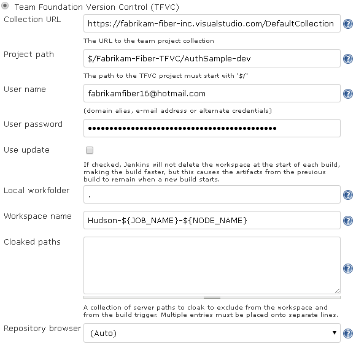

Team Foundation Server plugin for Jenkins
============================
Copyright &copy; Erik Ramfelt, Olivier Dagenais, CloudBees, Inc. and others.
Licensed under [MIT Licence].
 
## Summary
This plugin integrates [Team Foundation Version Control], also known as TFVC, to Jenkins by connecting to Team Foundation Server (TFS) and Visual Studio Team Services (VSTS).

## Quick links
* The legacy [wiki] page on the Jenkins Confluence instance
* Build status of master and pull requests: [](https://jenkins.ci.cloudbees.com/job/plugins/job/tfs-plugin) (thanks to [CloudBees]!)
* Issues are tracked by the [Jenkins JIRA]
* Download the latest release [from the Jenkins CDN](http://updates.jenkins-ci.org/latest/tfs.hpi) or [from the GitHub Releases page](https://github.com/jenkinsci/tfs-plugin/releases)

## What can you do with it?

Allows you to use TFS and VSTS as an SCM in Jenkins jobs. At the moment, this plugin supports:
* Retrieving read-only copies of files and folders from TFS/VSTS.
* Polling TFS/VSTS to automatically start builds when there are changes.
* Links from the Jenkins change sets to the TFS/VSTS web interface. _(Also known as a repository browser)_
* Creating a label in TFS

The plugin will automatically create a workspace in TFS/VSTS and map a work folder (in the Jenkins workspace) to it.

# Supported versions

The following sub-sections list the various versions of software that were tested and are thus supported.  The plugin might work with other versions, they just haven't been tested.

## Team Foundation Server (TFS) / Visual Studio Team Services (VSTS)

The plugin has been tested against [Visual Studio Team Services], as well as the following versions of Team Foundation Server:

* 2012 RTM
* 2013 RTM
* 2015 RTM

> :warning:  The following versions of TFS are **no longer supported** and may only _partially work_ with the plugin: :warning:

> Product | Mainstream Support End Date
> ------- | ---------------------------
> Microsoft Visual Studio Team Foundation Server 2010 | [2015/07/14](https://support.microsoft.com/en-us/lifecycle?p1=15011)
> Microsoft Visual Studio Team System 2008 Team Foundation Server | [2013/04/09](https://support.microsoft.com/en-us/lifecycle?p1=13083)
> Microsoft Visual Studio 2005 Team Foundation Server | [2011/07/12](https://support.microsoft.com/en-us/lifecycle?p1=10449)

## Operating Systems

The plugin has been tested against the following operating systems and versions, with the latest updates as of 2015/08/27.

Name | Version
---- | -------
Windows Server | 2012 R2
Mac OS X | Yosemite 10.10.5
Ubuntu Linux | Server 14.04 LTS

## Jenkins

The plugin is built against Jenkins version **1.448** and that's the version integration tests are run against.

# Configuration

## Requirements

### 4.0.0 and later (New!)

Ever since release 4.0.0, a command-line client or tool is no longer necessary as all the interaction with the TFS or VSTS server is done using the [TFS SDK for Java].  The native libraries needed by the SDK are automatically copied to a sub-directory under the agent user's home folder.

### 3.2.0 and earlier

Versions 3.2.0 and earlier of the plugin required a TFS command line tool to be installed on the build agents that will be retrieving source code from TFS.

1. Install either Microsoft Visual Studio or [Microsoft Team Explorer Everywhere] Command-Line Client (CLC) on the build agents
2. Add `tf.exe` (Visual Studio) OR one of `tf.cmd` or `tf` (TEE CLC) to the `PATH` of the build agents' user(s).

## Job configuration



Field | Description
----- | -----------
`Server URL` | The URL to the Team Project Collection. Examples: `https://tfs02.codeplex.com`, `https://example.visualstudio.com/DefaultCollection`, `http://tfs:8080/tfs/DefaultCollection`
`Project path` | The Team Project and path to retrieve from the server. The project path must start with `$/`, and contain any sub path that exists in the project repository. Example: `$/project/trunk/src`.
`User name` | The name of the user that will be connecting to TFS/VSTS to query history, checkout files, etc. See _User name and password_ below for a full description.
`User password` | The password, alternate password or personal access token associated with the user. See _User name and password_ below for more details.
`Use update` | If this option is checked, then the workspace and work folder will not be removed at the end of build. This makes the build faster, but artifacts remain between builds. If it is not checked, the plugin will create a workspace and map it to a local folder at the start of the build, and then delete the workspace at the end of the build.
`Local workfolder` | The name of the local work folder. The specified folder will contain the files retrieved from the repository. Default is `.`, ie the files will be downloaded into the Hudson workspace folder.
`Workspace name` | The name of the workspace that Jenkins should use when creating and deleting workspaces on the server. The workspace name supports three macros; `${JOB_NAME}` is replaced by the job name, `${USER_NAME}` is replaced by the user name Jenkins is running as and `${NODE_NAME}` is replaced by the name of the node. Default workspace name is `Hudson-${JOB_NAME}-${NODE_NAME}`.
`Repository browser` | If the Team Foundation Server has any web access to the files, this can be configured here. By adding a repository browser, the plugin will create links in the Changes page to the repository browser. Currently the plugin supports Team System Web Access.

### User name and password

#### Team Foundation Server (on-premises)

For \[on-premises\] Team Foundation Server, the _User name_ can be specified in two ways:

1. `EXAMPLE-DOMAIN\user`
2. `user@domain.example.com`

#### Visual Studio Team Services (VSTS, a.k.a. TFS in the cloud, previously known as Visual Studio Online)

For VSTS, there are also two options:

1. Personal access tokens (recommended)
    1. In VSTS, click your name in the top right corner and select **My profile**.
    2. Select the **Security** hub.
    3. In the _Personal access tokens_ area, select **Add**.
    4. Describe the token (use something like "Jenkins server at jenkins.example.com"), select an expiry timeframe, double-check the VSTS account the token will be valid for and, until the corresponding defect in VSTS is fixed, select **All scopes**.
    5. Click **\[Create Token\]** and copy the generated personal access token to the clipboard.
    6. Back to Jenkins, enter the e-mail address associated with your VSTS account as the _User name_ and the generated personal access token as the _User password_.
2.  Alternate credentials
    1. In VSTS, click your name in the top right corner and select **My profile**.
    2. Select the **Security** hub.
    3. In the _Alternate credentials_ area, select **Enable alternate authentication credentials**.
    4. Enter a secondary user name and password, then click **\[Save\]**.
    5. Back to Jenkins, re-enter those credentials in the _User name_ and _User password_ fields.


## Checkout by label (New since version 3.2.0)

The plugin now supports checking out from a specific label.  Here's how to configure a job to do that:

> :information_source: Polling the server doesn't make sense when you want to build for a specific label because polling is not \[currently\] label-aware and could queue a build **every polling interval**. :information_source:

1. Turn **off** SCM polling by making sure the **Poll SCM** checkbox is _cleared_ (unchecked).
2. Tick the **This build is parameterised** checkbox
    1. Add a **String Parameter**
    2. Set its _Name_ to **VERSION_SPEC**
    3. Set its _Description_ to the following:
    ```
    Enter a valid version spec to use when checking out.
    Labels are prefixed with "L" and can optionally be scoped by appending "@" with a scope name
    (see the documentation on the Label Command at https://msdn.microsoft.com/en-us/library/9ew32kd1.aspx).
    Example: "LFoo"
    ```
3. **Save** the job.

Now, the next time you want to queue a build, you will need to provide a value for the **VERSION_SPEC** parameter.  The build will then perform a checkout of the source as of the specified **VERSION_SPEC**.

## Build environment variables

The plugin will set the following environment variables for the build, after a checkout:

* **TFS_WORKSPACE** \- The name of the workspace.
* **TFS_WORKFOLDER** \- The full path to the working folder.
* **TFS_PROJECTPATH** \- The project path that is mapped to the workspace.
* **TFS_SERVERURL** \- The URL to the Team Foundation Server.
* **TFS_USERNAME** \- The user name that is used to connect to the Team Foundation Server.
* **TFS_CHANGESET** \- The change set number that is checked out in the workspace


# FAQ

### How should I set up the plugin for my CodePlex project?

* Find out the TFS server for your project, which is displayed in the source code page for your project at codeplex.com.
* The user name must be suffixed with `_cp` and the domain is `snd`. If your user name is redsolo, then enter "`snd\redsolo_cp`" as the user name in the plugin configuration.
* Note that the user must be a member of the project to be able to create a workspace on the Team foundation server.

That's all you need to do to start retrieving files from your project at codeplex.com.

### The plugin is having problems parsing the dates that TF outputs, what can I do?

> :information_source: If you can upgrade to version 4 and up, then you can avoid a whole class of TF output parsing difficulties, otherwise, read on. :information_source:

The TF command line outputs date according to the locale and Microsofts own specification. Sometimes the outputed date can not be parsed by any of the default locale dependent parsers that the JDK includes (_for some more details, see_ _[JENKINS-4184]_ _and_ _[JENKINS-4021]_). This will throw an exception in the change set parsing and fail the build.

To fix this, do the following:
* Change the locale by Windows Regional Settings to United States and English on the server and all hudson nodes. After that tf.exe should output dates in english, which can be parsed properly.
* Start Hudson using the UnitedStates, English locale. Either set it using `-Duser.language=en -Duser.country=US` on the command line or check the documentation for the container that Hudson is running within.

# Timeline

## Future

The best way to get an idea of what will be coming in future releases is to look at the [list of open pull requests](https://github.com/jenkinsci/tfs-plugin/pulls).

## Present

The next upcoming release will be 4.1.0.  See what's been committed [since 4.0.0](https://github.com/jenkinsci/tfs-plugin/compare/tfs-4.0.0...master).

* Major:
    * Add workspace cloaking. Thanks to Aaron Alexander (@ajalexander) and Luke Watson (@watsonlu) who helped implement [JENKINS-4709](https://issues.jenkins-ci.org/browse/JENKINS-4709). Made possible through the following pull requests: #28, #60, #64 and #68.
* Minor:
    * Fix VSTS workspace management by upgrading to TFS SDK to 14.0.2 and better detection of existing workspaces. (pull request #67)
    * Fix repository browser URL persistence. Thanks to Manfred Moser (@mosabua) who fixed [JENKINS-30703](https://issues.jenkins-ci.org/browse/JENKINS-30703) with pull request #69.
* Planned:
    * Support connecting through a proxy. Thanks to @ytterx for fixing [JENKINS-6933](https://issues.jenkins-ci.org/browse/JENKINS-6933) with pull request #66.

## Past

Details about previous releases can be found on the [Releases page](https://github.com/jenkinsci/tfs-plugin/releases).

[wiki]: http://wiki.jenkins-ci.org/display/JENKINS/Team+Foundation+Server+Plugin
[MIT Licence]: http://opensource.org/licenses/MIT
[CloudBees]: https://www.cloudbees.com/
[Jenkins JIRA]: http://issues.jenkins-ci.org/secure/IssueNavigator.jspa?mode=hide&reset=true&jqlQuery=project+%3D+JENKINS+AND+status+in+%28Open%2C+%22In+Progress%22%2C+Reopened%29+AND+component+%3D+%27tfs-plugin%27
[Team Foundation Version Control]: https://msdn.microsoft.com/en-us/library/ms181237.aspx
[Visual Studio Team Services]: https://www.visualstudio.com/products/visual-studio-team-services-vs
[TFS SDK for Java]: http://blogs.msdn.com/b/bharry/archive/2011/05/16/announcing-a-java-sdk-for-tfs.aspx
[Microsoft Team Explorer Everywhere]: http://www.microsoft.com/en-us/download/details.aspx?id=40785
[JENKINS-4021]: https://issues.jenkins-ci.org/browse/JENKINS-4021
[JENKINS-4184]: https://issues.jenkins-ci.org/browse/JENKINS-4184
